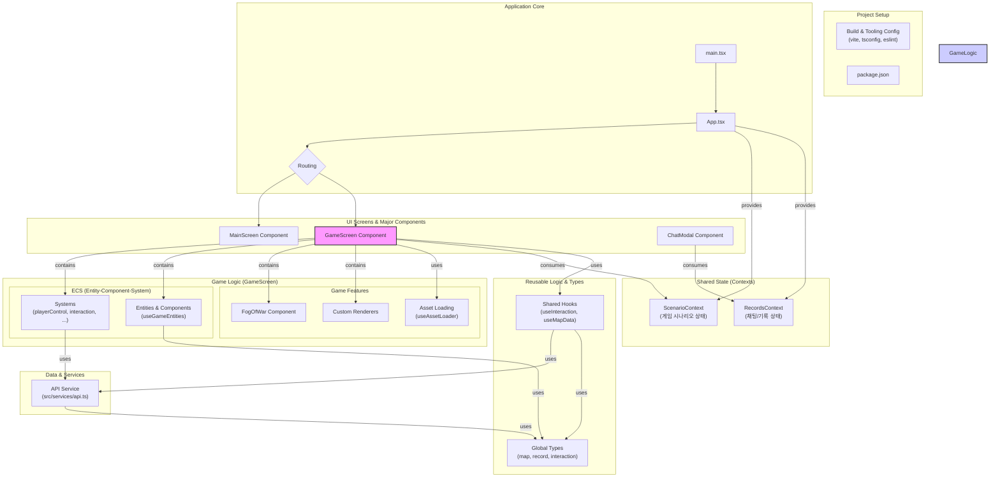

```mermaid
graph TD
    subgraph "Project Setup"
        direction LR
        Config["Build & Tooling Config<br/>(vite, tsconfig, eslint)"]
        Package[package.json]
    end

    subgraph "Application Core"
        direction TB
        EntryPoint[main.tsx] --> App[App.tsx]
        App --> Router{"Routing"}
    end

    subgraph "UI Screens & Major Components"
        direction TB
        MainScreen[MainScreen Component]
        GameScreen[GameScreen Component]
        ChatModal[ChatModal Component]
    end
    
    Router --> MainScreen
    Router --> GameScreen

    subgraph "Game Logic (GameScreen)"
        subgraph "ECS (Entity-Component-System)"
            GameSystems["Systems<br/>(playerControl, interaction, ...)"]
            GameEntities["Entities & Components<br/>(useGameEntities)"]
        end
        subgraph "Game Features"
            FogOfWar[FogOfWar Component]
            Renderers[Custom Renderers]
            AssetLoader["Asset Loading<br/>(useAssetLoader)"]
        end
    end
    
    GameScreen -- contains --> GameSystems
    GameScreen -- contains --> GameEntities
    GameScreen -- contains --> FogOfWar
    GameScreen -- contains --> Renderers
    GameScreen -- uses --> AssetLoader

    subgraph "Shared State (Contexts)"
        direction LR
        ScenarioContext["ScenarioContext<br/>(게임 시나리오 상태)"]
        RecordsContext["RecordsContext<br/>(채팅/기록 상태)"]
    end

    subgraph "Data & Services"
        direction LR
        APIService["API Service<br/>(src/services/api.ts)"]
    end

    subgraph "Reusable Logic & Types"
        direction LR
        SharedHooks["Shared Hooks<br/>(useInteraction, useMapData)"]
        TS_Types["Global Types<br/>(map, record, interaction)"]
    end

    %% --- Relationships ---
    App -- provides --> ScenarioContext
    App -- provides --> RecordsContext

    GameScreen -- consumes --> ScenarioContext
    GameScreen -- uses --> SharedHooks
    ChatModal -- consumes --> RecordsContext
    
    SharedHooks -- uses --> APIService
    GameSystems -- uses --> APIService
    
    APIService -- uses --> TS_Types
    GameEntities -- uses --> TS_Types
    SharedHooks -- uses --> TS_Types
    
    style GameScreen fill:#f9f,stroke:#333,stroke-width:2px
    style GameLogic fill:#ccf,stroke:#333,stroke-width:2px
```